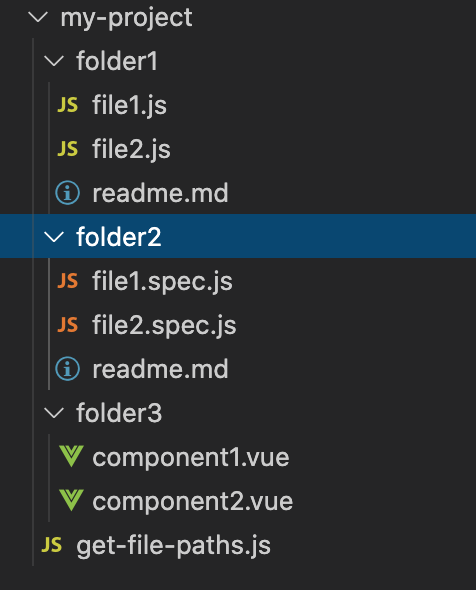

# Find all files recursively in a directory with a given extension using Node.js

Here it's how to find all files in a `directory` using Node.js.

- first, navigate to your project's `root` folder & create a file named `get-file-paths.js` by running the command `cd <enter/your/project/root/path/here> && touch get-file-paths.js`.
- now, let's import [Node's built-in modules](https://www.w3schools.com/nodejs/ref_modules.asp) [`fs`](https://nodejs.org/api/fs.html) & [`path`](https://nodejs.org/api/path.html) like so:
```js
const fs = require('fs');
const path = require('path');
```
- Let's create a utility `function` to filter the future `array` of files `paths` by file's extension like so:

```js
const filterFilesByExtension = ({ files, extension } = {}) => {
  return files.filter(file => file.includes(extension));
};
```
The `filterFilesByExtension` method will take the `files` & `extension` params. These `params` will respectively hold the `array` of file paths & the file extension we wish to search for. 

The `function` combines the JavaScript built-in `array` methods [`filter()`](https://developer.mozilla.org/en-US/docs/Web/JavaScript/Reference/Global_Objects/Array/filter) & [`includes()`](https://developer.mozilla.org/en-US/docs/Web/JavaScript/Reference/Global_Objects/Array/includes). The `filter()` method will go through each element on the provided `array` & return a new `array` with values coerced to `true` by the `includes` method.

- Then, we're ready to create the `method` to get all file paths in a `directory` like so:

```js
const getAllFilesPath = (dirPath, arrayOfFiles) => {
  const files = fs.readdirSync(dirPath);
  arrayOfFiles = arrayOfFiles || [];

  files.forEach(file => {
    if (fs.statSync(`${dirPath}/${file}`).isDirectory()) {
      arrayOfFiles = getAllFilesPath(`${dirPath}/${file}`, arrayOfFiles);
    } else {
      arrayOfFiles.push(path.join(dirPath, '/', file));
    }
  });

  return arrayOfFiles;
};
```
The `getAllFilesPath` method will get all file paths in your `directory`. This method will take two `params` the `dirPath` & `arrayOfFiles`. The `dirPath` param will be a placeholder for the `directory`'s `path` we want to make a search & the `arrayOfFiles` param will contain all files within the `directory`.

The [`readdirSync`](https://nodejs.org/api/fs.html#fs_fs_readdirsync_path_options) is used to synchronously read the contents of a given `directory` & return an `array` containing those `values`.

Then, we'll loop through the `array` & check if each file describes a file system directory. If `true` we call the method `getAllFilesPath` recursively, if `false` we construct a proper file path with the [`path.join()`](https://nodejs.org/api/path.html#path_path_join_paths) method. Finally, we store the final result into the `arrayOfFiles` array & return it.

- We're ready to call `getAllFilesPath` function & added the result to a `variable` named `allFilesPath`. This `variable` holds all the file paths in an `array` of `strings`

```js
// array containing all file paths
const allFilesPath = getAllFilesPath(`${__dirname}`); // _dirname is the current file's path
```

Finally, if we want to get all file paths for a specific file extension. We can call the utility function `filterFilesByExtension` like so:

```js
const allSpecFiles = filterFilesByExtension({
  files: allFilesPath, // array of all file paths in the directory
  extension: '.js', // file extension we wish to search for
});

console.log(allSpecFiles); // print all file paths by a specific extension
```

Let's say we have a project with a file structure similar to the screenshot below:



If you now run `node get-file-paths.js`(from the project's `root` folder), you'll get an `array` of `strings` containing all your file paths from `.js` file extension in your directory!

```js
[
  'your/project/root/path/my-project/folder1/file1.js',
  'your/project/root/path/my-project/folder1/file2.js',
  'your/project/root/path/my-project/folder2/file1.spec.js',
  'your/project/root/path/my-project/folder2/file2.spec.js',
  'your/project/root/path/my-project/get-file-paths.js'
]
```

This is the final code snippet:

```js
const fs = require('fs');
const path = require('path');

const filterFilesByExtension = ({ files, extension } = {}) => {
  return files.filter(file => file.includes(extension));
};

const getAllFilesPath = (dirPath, arrayOfFiles) => {
  const files = fs.readdirSync(dirPath);
  arrayOfFiles = arrayOfFiles || [];

  files.forEach(file => {
    if (fs.statSync(`${dirPath}/${file}`).isDirectory()) {
      arrayOfFiles = getAllFilesPath(`${dirPath}/${file}`, arrayOfFiles);
    } else {
      arrayOfFiles.push(path.join(dirPath, '/', file));
    }
  });

  return arrayOfFiles;
};

const allFilesPath = getAllFilesPath(`${__dirname}`);

const allSpecFiles = filterFilesByExtension({
  files: allFilesPath,
  extension: '.js',
});

console.log(allSpecFiles);
```

I hope you found this helpful!
