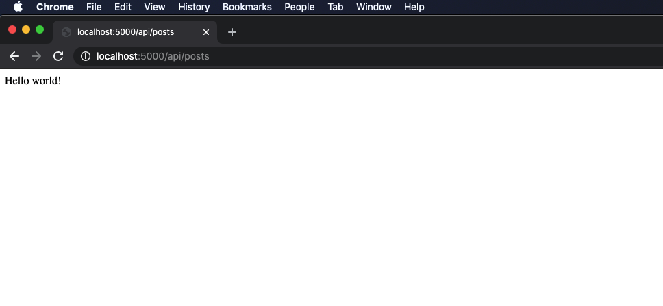

# How to create a simple RESTful API with NodeJs, ExpressJs & MongoDb (part 2)

Continuing from where we left off, we have now a server running on port `5000`. Now, let's create the `routes` to perform [CRUD](https://en.wikipedia.org/wiki/Create,_read,_update_and_delete) operations on a `posts` object.

Inside the `server` folder, we'll create another folder named `routes` & a folder `api` inside of it. Finally, inside the `api` folder, we'll create the file `posts.js` which will hold all our `routes`.

From the project's `root` directory, run the command:
```
cd server && mkdir routes && cd routes && mkdir api && cd api && touch posts.js
```

In the `posts.js` file, copy the following code snippet:
```js
// imports express & MongoDB driver
const express = require('express');
const mongodb = require('mongodb');

// creates the router
const router = express.Router();

// GET Posts
router.get('/', (req, res) => {
    // sends a HTTP response to the browser
    res.send('Hello World!'); 
});
// export the router
module.exports = router;
```

A quick breakdown of what we did! 

- We imported `express` & the `mongodb` driver.
- We created the `router`.
- We defined a `GET` route & send an `HTTP` response to the `browser` with the message "Hello World".
- Finally, we exported the `router` module to be used elsewhere.

Now, we need to import this `module` & set the route to the `posts` module in our app's entry point `index.js` file like so:

```js
// index.js file
....
// imports posts module
const posts = require('./routes/api/posts');

// set the routes to posts module
app.use('/api/posts', posts);
...
```

If you have been following along correctly, your `index.js` file should contain the following code snippet:

```js
// import packages
const express = require('express');
const cors = require('cors');

// initialize express app
const app = express();

// Set middlewares
app.use(express.json())
app.use(cors());

// imports posts module
const posts = require('./routes/api/posts');

// set the routes to posts module
app.use('/api/posts', posts);

// variable to hold the port number for our app to listen for
const port = process.env.PORT || 5000;

// starts our server on port 5000
app.listen(port, () => {
  console.log(`Server started on port: ${port}`)
});
```

Now you can run the command `npm run dev`. Then, we can head to our `browser` & enter the following endpoint `http://localhost:5000/api/posts`  & we should get a `Hello World` message in the `browser` as showing in the screenshot below:



Now, we're ready to start using a database. In the next article, we'll set up `MongoDB`'s database.

### Links:

- [Part 1](https://manuel-abascal.web.app/2021/01/31/how-to-create-a-restful-api-with-nodejs-expressjs-mongodb/)