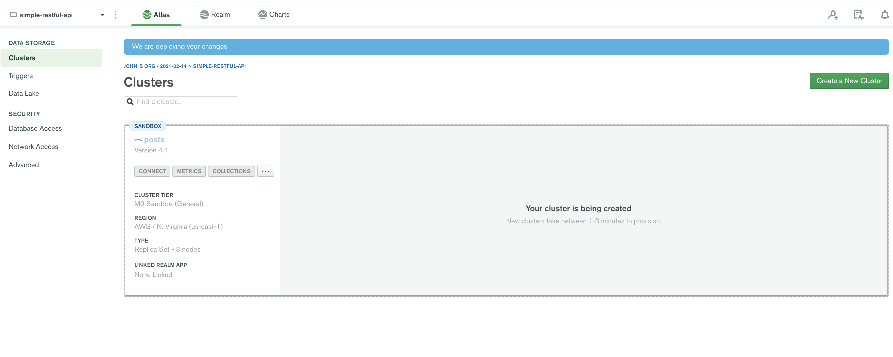
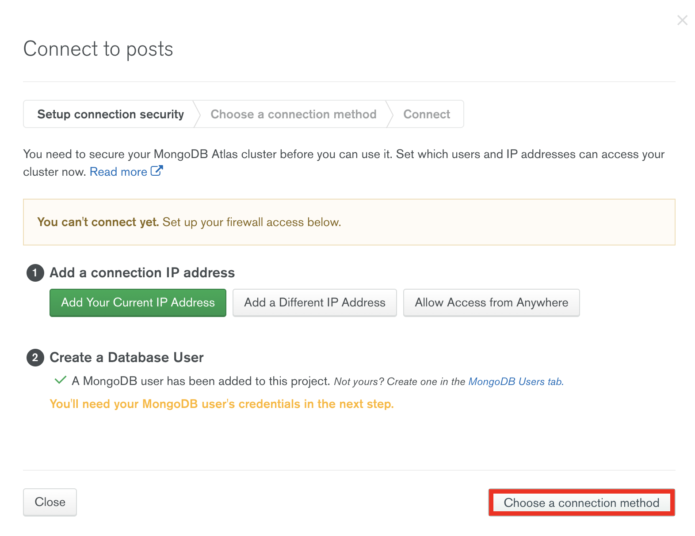
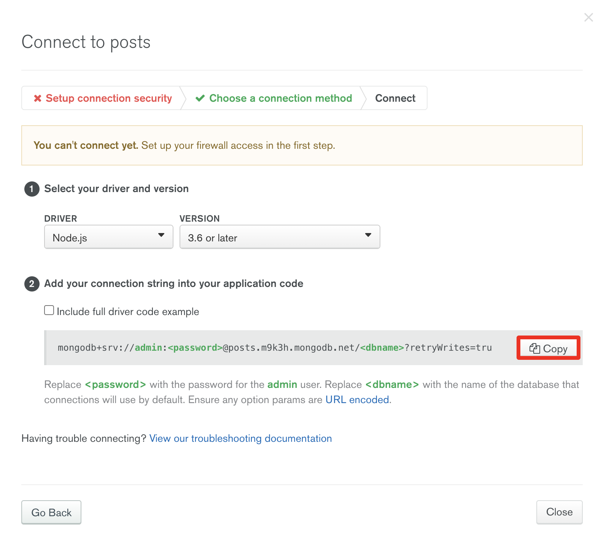
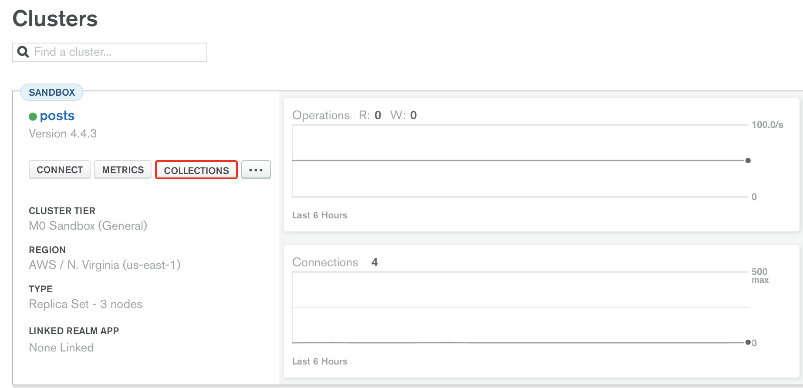

# How to create a simple RESTful API with NodeJs, ExpressJs & MongoDb (part 3)

Now, it's time to connect to our database. We'll be using [mLab](https://mlab.com/) which is a fully managed cloud database service that hosts MongoDB databases. It's totally free until a certain tier of storage (`500 MBs`) so go ahead & sign up for a free account:

- Go to the [mLab's homepage](https://mlab.com/) & click on the `SIGN UP` button:


- Enter the information required to create a new account:


- You'll be prompt to set up your account, select the `Project Name`, the language (in this case `JavaScript`) & click on `Continue`:


- Select the `cluster`:


- Create a new `cluster` named `posts`, select the `region` & click on `Create Cluster`:


- Now, it'll start the `cluster` creation. It might take a few minutes:



- Once the `cluster` is created, we need to connect to our database by clicking on the `Connect` button:


- We need to create a `database's user`, enter the  `username` & `password` for the new `user`:


- Choose a connection method to connect to the database:



- In our case will choose `MongoDB's native drivers`:


-  Let's copy our `Connection URI` by clicking on the `Copy` button: 



Now, let's head to our code editor & create a `function` called `getPostsCollection` which will connect to our database & fetch all the `data` from `posts` collection.

```js
// posts.js
...
const getPostsCollection = async () => {
    const client = await mongodb.MongoClient.connect('mongodb+srv://admin:<password-placehoder>@posts.m9k3h.mongodb.net/<dbname-placeholder>?retryWrites=true&w=majority', {
        useNewUrlParser: true,
    });

    return client.db('<dbname-placehoder>').collection('<collection-name-placeholder>');
}
```

Make sure to type your `password`, the `database name` & the `collection name` in the `<password-placeholder>`, `<dbname-placeholder>` & `<collection-name-placeholder>` respectively in the `mongodb.MongoClient.connect()` method & in the `client.db('<dbname-placehoder>').collection('<collection-name-placeholder>')` chained methods.

Now that our database is properly connected, let's modify the `GET` request method to fetch all the `data` when hitting the `/api/posts` route instead of `Hello World`:

```js
// GET Posts
router.get('/', async (req, res) => {
    console.log(req)
    const posts = await getPostsCollection();
    res.send(await posts.find({}).toArray());
});
```

If you follow the instructions correctly. The `posts.js` file should contain the following code:

```js
// imports express & MongoDB driver
const express = require('express');
const mongodb = require('mongodb');

// creates the router
const router = express.Router();

// GET Posts
router.get('/', async (req, res) => {
    console.log(req)
    const posts = await getPostsCollection();
    res.send(await posts.find({}).toArray());
});

// connects to the database & retrieves all data from posts collection
const getPostsCollection = async () => {
    const client = await mongodb.MongoClient.connect('mongodb+srv://admin:<password-placehoder>@posts.m9k3h.mongodb.net/<dbname-placeholder>?retryWrites=true&w=majority', {
        useNewUrlParser: true,
    });

    return client.db('<dbname-placeholder>').collection('<collection-name-placeholder>');
}

// export the router
module.exports = router;
```

- Now, let's go back to our `cluster` & click `Create Collection` button:



- Click on `Add my own data` button:


- Enter a `Database & Collection Name` & click on `Create` button:


Now, go to the project's `root` folder & run the command `npm run dev`, you should receive an empty `[]` representing the `posts` collection which currently has no data on it.


In the next tutorial, we'll add `POST`, `DELETE` & `UPDATE` routes!

- [Part 1](https://manuel-abascal.web.app/2021/01/31/how-to-create-a-restful-api-with-nodejs-expressjs-mongodb/)
- [Part 2](https://manuel-abascal.web.app/2021/02/07/how-to-create-a-restful-api-with-nodejs-expressjs-mongodb-2/)