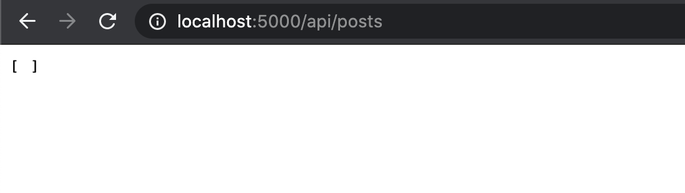

# How to create a simple RESTful API with NodeJs, ExpressJs & MongoDb (part 4 - Final)

In the last tutorial, we were able to connect to a MongoDb database, create a `function` to fetch all `posts` & create a `GET` route request method to retrieve all `posts` from the database. 

In this tutorial, we'll create three more routes to add, delete & update new `posts` respectively (`POST`, `DELETE` & `PUT`).

In the `posts.js` file, go ahead & add the following code snippet:

```js
// Add post request
router.post('/', async (req, res) => {
    // retrieve all posts collection & store in a posts variable
    const posts = await loadPostCollection();
    
    // inserts a new post object with a title, text & createdAt property in the dabatabase
    await posts.insertOne({
        title: req.body.title,
        text: req.body.text,
        createdAt: new Date(),
    });
    
    // sends a 201 status
    return res.status(201).send();
});
```

With this `POST` request route, we called the `loadPostCollection` method to retrieve all the `posts` collection from our database & insert a new `post` object containing the properties `title`, `text` & `createdAt`. Finally, we send a [`201` response status](https://developer.mozilla.org/en-US/docs/Web/HTTP/Status/201) which indicates the request succeeded.

Now, let's use [Postman](https://www.postman.com/) to quickly & easy send [REST requests](https://en.wikipedia.org/wiki/Representational_state_transfer). Let's create a `POST` request to the following endpoint: `http://localhost:5000/api/posts/`, we must select `JSON` content & passed a `JSON` object like so:

```json
{
    "title": "Post title 1",
    "text": "This is the text"
}
```

We finally click on the `Send` button. We should receive a `201` status code as in the screenshot below:


Now, if we refresh our `browser` we should get the first, newly created `post` in our previously empty `array` of `posts` collection as showing in the following screenshot:


Now, let's create a `PUT` request to edit our newly created `post`. Copy & paste the following code snippet:

```js
// PUT(update) post request
router.put('/:id', async (req, res) => {
    // retrieve all posts collection & store in a posts variable
    const posts = await loadPostCollection();
    
    // we found & update a specific post using the id property passed in the endpoint with :id
    await posts.findOneAndUpdate({ 
        _id: new mongodb.ObjectID(req.params.id)
    },
    {
       // we passed an object with post's properties we want to update
        $set: {
            title: req.body.title,
            text: req.body.text,
            createdAt: new Date(),
        }
    }
    );
    // we send a 201 response status
    res.status(201).send();
});
```

With this `PUT` request route, once again we called the `loadPostCollection` method to retrieve all the `posts` collection from our database & update a specific `post` by passing the post's `ID` we wish to update/edit. 

Finally, we send a [`201` response status](https://developer.mozilla.org/en-US/docs/Web/HTTP/Status/201) which indicates the request succeeded.

Once again, go to `postman` & passed the post's `ID` in the following endpoint: `http://localhost:5000/api/posts/<specific-post-id-goes-here>`, select the `PUT` request & passed the following `JSON` object representing the post's properties we wish to udpate/edit & their new values. Then click on the `Send` button.


 
 You should receive a `201` status code. Now go to your `browser` & refresh it. You should see the post updated with new values.


Finally, let's go ahead & create a `Delete` route request to remove a `post` from the collection. Copy & paste the following code snippet:

```js
// Delete post request
router.delete('/:id', async (req, res) => {
    // retrieve all posts collection & store in a posts variable
    const posts = await loadPostCollection();
    
    // deletes a post from the collection by passing the id param in the endpoint with :id
    await posts.deleteOne({ _id: new mongodb.ObjectID(req.params.id) });

     // sends a 200 status
    res.status(200).send();
});
```

With this `DELETE` request route, once again we called the `loadPostCollection` method to retrieve all the `posts` collection from our database & delete a `post` by passing the specific post's `ID` we wish to delete. 

Finally, we send a [`200` response status](https://developer.mozilla.org/en-US/docs/Web/HTTP/Status/200) which indicates the request succeeded.

Once again, go to `postman` & passed the post's `ID` in the following endpoint: `http://localhost:5000/api/posts/<specific-post-id-goes-here>`, select the `DELETE` request & click on the `Send` button.


You should receive a `200` status code. Now go to your `browser` & refresh it. You shouldn't be able to see the previously created `post`. Instead you should see an empty `array`.



If you follow the steps correctly, your `posts.js` file has the following code:

```js
const express = require('express');
const mongodb = require('mongodb');

const router = express.Router();

router.get('/', async (req, res) => {
    console.log(req)
    const posts = await loadPostCollection();
    res.send(await posts.find({}).toArray());
});

router.post('/', async (req, res) => {
    const posts = await loadPostCollection();
    await posts.insertOne({
        title: req.body.title,
        text: req.body.text,
        createdAt: new Date(),
    });
    return res.status(201).send();
});

router.delete('/:id', async (req, res) => {
    const posts = await loadPostCollection();
    await posts.deleteOne({ _id: new mongodb.ObjectID(req.params.id) });
    res.status(200).send();
});

router.put('/:id', async (req, res) => {
    const posts = await loadPostCollection();
    await posts.findOneAndUpdate({ 
        _id: new mongodb.ObjectID(req.params.id)
    },
    {
        $set: {
            title: req.body.title,
            text: req.body.text,
            createdAt: new Date(),
        }
    }
    );
    res.status(201).send();
});

const getPostsCollection = async () => {
    const client = await mongodb.MongoClient.connect('mongodb+srv://admin:<password-placehoder>@posts.m9k3h.mongodb.net/<dbname-placeholder>?retryWrites=true&w=majority', {
        useNewUrlParser: true,
    });

    return client.db('<dbname-placeholder>').collection('<collection-name-placeholder>');
}

module.exports = router;
```

And there you have it. Congratulations, you have built a simple `RESTful API` with [ExpressJs](https://expressjs.com/), [MongoDB](https://www.mongodb.com/) & [NodeJs](https://www.mongodb.com/) doing a basic [CRUD operations](https://developer.mozilla.org/en-US/docs/Glossary/CRUD)!

- [Part 1](https://manuel-abascal.web.app/2021/01/31/how-to-create-a-restful-api-with-nodejs-expressjs-mongodb/)
- [Part 2](https://manuel-abascal.web.app/2021/02/07/how-to-create-a-restful-api-with-nodejs-expressjs-mongodb-2/)
- [Part 3](https://manuel-abascal.web.app/2021/02/14/how-to-create-a-restful-api-with-nodejs-expressjs-mongodb-3/)