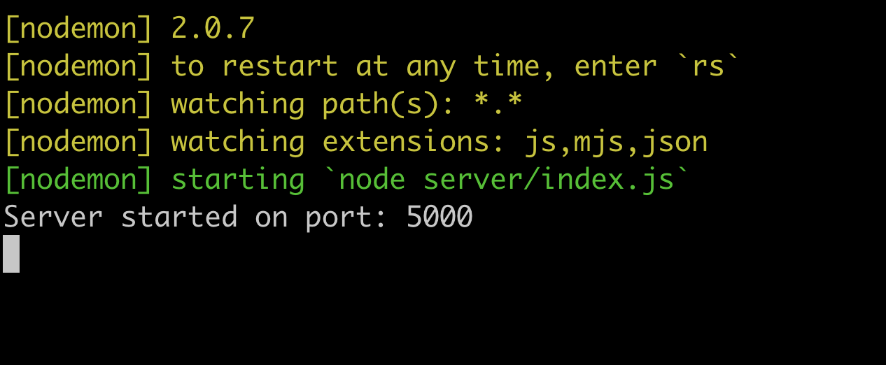

# How to Create a simple RESTful API with NodeJs, ExpressJs & MongoDb (part 1)

## Prerequisites:
Before we start you need to have the following installed:

- [Node.js](https://nodejs.org/en/) installed in your machine.
- A code editor - I suggest [Visual Studio Code](https://code.visualstudio.com/), but any editor will do...
- [Postman](https://www.postman.com/)

## Project Configuration & getting a server running
Let's start by creating the project folder, navigating to it & initializing a `package.json` file by running the command `mkdir simple-restful-api && cd simple-restful-api && npm init -y`.

Now, we can go ahead & install the dependencies for this project. We're going to need the following:

- [Express.js](https://expressjs.com/) - a minimalist web framework to build web applications quickly & easily.
- [Cors](https://www.npmjs.com/package/cors) - to avoid the `cross-origin` error from Chrome.
- [MongoDB](https://www.npmjs.com/package/mongodb) - the official MongoDB driver for NodeJs.
- [Nodemon](https://www.npmjs.com/package/nodemon) - a tool to automatically restart a node application when changes are applied to a file.

We can run the command: `npm i --save express cors mongodb` to install all these packages as regular dependencies & `npm i -D nodemon` as dev dependencies.

Now, let's open our `package.json` file in our code editor & add a `script` to run our app like so:

```json
{
  "name": "simple-restful-api",
  "version": "1.0.0",
  "description": "",
  "main": "index.js",
  "scripts": {
    "dev": "nodemon server/index.js" // will initialize server/index.js file with nodemon
  },
  "keywords": [],
  "author": "",
  "license": "ISC",
  "dependencies": {
    "cors": "^2.8.5",
    "express": "^4.17.1",
    "mongodb": "^3.6.3"
  },
  "devDependencies": {
    "nodemon": "^2.0.7"
  }
}
```

We should now create our a `server` folder & an `index.js` file by running the command: `mkdir server && cd server && touch index.js`. Let's head to the newly, created `index.js` file (which it's going to be our app's entry point) in the code editor & type the following code snippet:

```js
// import packages
const express = require('express');
const cors = require('cors');

// initialize express app
const app = express();

// Set middlewares
app.use(express.urlencoded({ extended: true }));
app.use(cors());

// variable to hold the port number for our app to listen for
const port = process.env.PORT || 5000;

// starts our server on port 5000
app.listen(port, () => {
  console.log(`Server started on port: ${port}`)
});
```

This code snippet will import our dependency `packages`, set the `middlewares` & start our server on port `5000`. To initialize our server, we can run the command `cd .. && npm run dev`. If everything is working properly you should get the following in your terminal:



Congratulations!, we now have our server up & running. In the next part, we'll cover how to set a MongoDB database with [mLab](https://mlab.com/) & add routes to perform `CRUD operations`.

- [Part 2](https://manuel-abascal.web.app/2021/02/07/how-to-create-a-restful-api-with-nodejs-expressjs-mongodb-2/)
