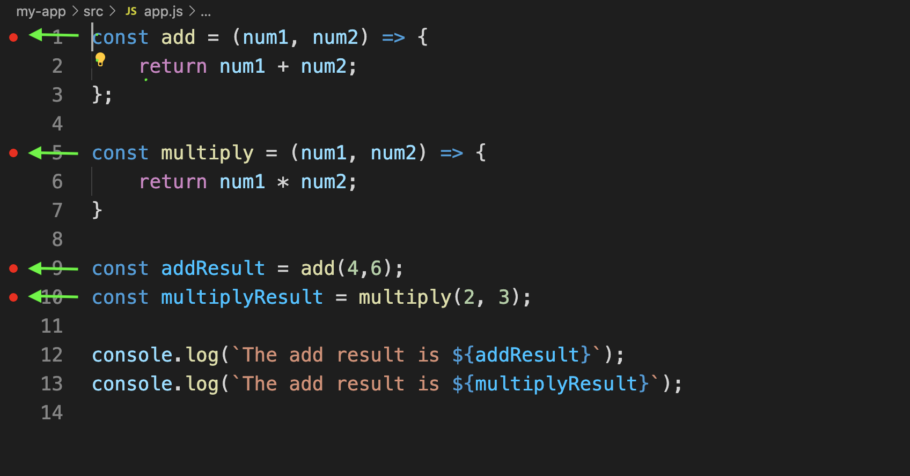
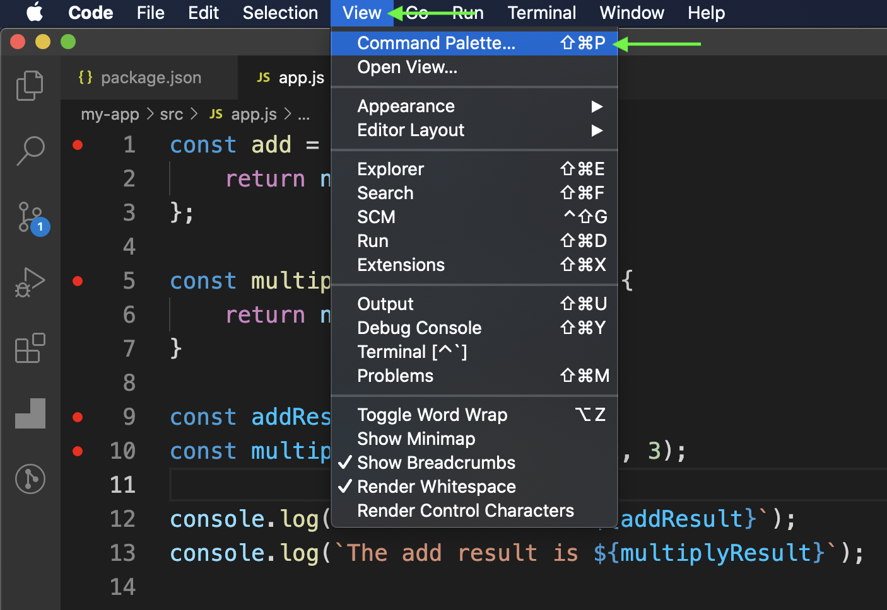
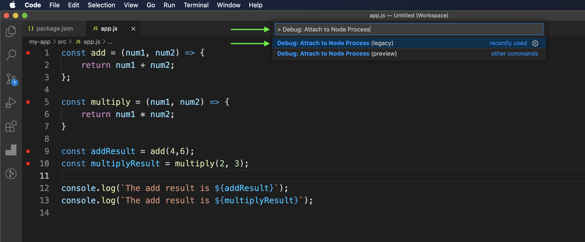
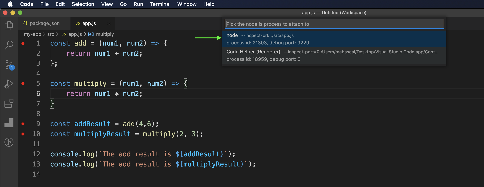
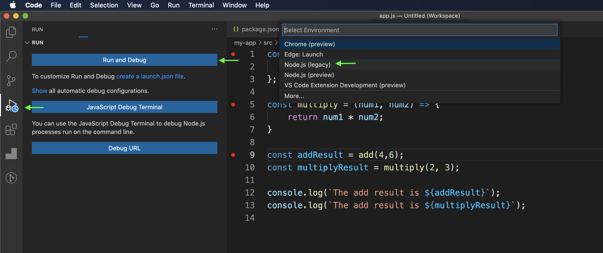
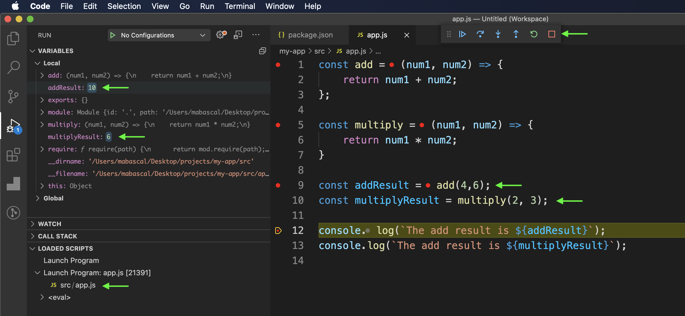

# How to debug a Node.js Application in Visual Studio Code

First, let's create a simple Node application to showcase how to debug it. I'm assuming you have [Node.js](https://nodejs.org/en/) (Node 8 or later) already installed on your computer.

* Using the terminal, create the folder to store the application & navigate to it:
```
mkdir my-app && cd my-app
```
* Start a project with [NPM](https://docs.npmjs.com/) (it is installed along with Node):

```
npm init -y
```
  The `-y` flag is used to skip all the questionnaire in the prompt. If everything went well, you should have a new `package.json` file in your project.
 
 Now let's create an `src` folder & `app.js` file in it which will hold our application code like so:
 
```
mkdir src && cd src && touch app.js
```
The next step is to open our application using the [Visual Studio Code](https://code.visualstudio.com/) code editor and open the `app.js` file.

To test our debugger, I'll create two `methods` to do some basic `maths`, store their `return` value, and print a message with the final outputs.

```js
const add = (num1, num2) => {
    return num1 + num2;
};

const multiply = (num1, num2) => {
    return num1 * num2;
}

const addResult = add(4,6);

const multiplyResult = multiply(2, 3);

console.log(`The add result is ${addResult}`);
console.log(`The add result is ${multiplyResult}`);
```
Now, we need to open the `my-app/package.json` file & add `script` with `--inspect-brk` flag in order to enable [Node's built-in debugger](https://nodejs.org/en/docs/guides/debugging-getting-started/#command-line-options) like so:

```json
{
  "name": "my-app",
  "version": "1.0.0",
  "description": "",
  "main": "index.js",
  "scripts": {
    "node:debugger": "node --inspect-brk ./src/app.js"
  },
  "keywords": [],
  "author": "",
  "license": "ISC"
}
```

We should be able to start the debugger now from the terminal. Go to the project's `root` folder & run the command:

```
npm run node:debugger
```
Congratulations, the debugger is enabled! 

- In your code editor, select some `breakpoints` in your code( where you want to pause the code execution):



- Go to the `View` tab, click on it & select `Command Palette`:



- Type `Debug: Attach to Node Process` & click on it.



- Pick process to process to attach:



You're ready to run the debugger, click on the debug icon on the left vertical tab of your editor, click on `Run and Debug` button, then select `Node.js` from the dropdown option.



Now, you will be able to pause your code, inspect `variables`, loaded `scripts` & `call stack`. 



You won't be needing to litter your code with `console.log()` anymore! :rocket: