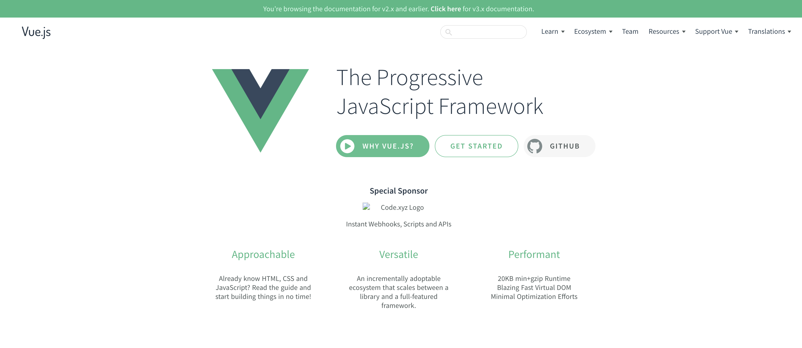

# How To Pass Data From Child to a Parent Component in Vue.js



[Vue.js](https://vuejs.org/) is a progressive framework for building user interfaces. It allows building applications composed of small, self-contained, and reusable components. Since the components allow us to make our code more modular by being self-contained, it also means that they are isolated from other components. In Vue, we passed data from parent to child components by using [props](https://vuejs.org/v2/guide/components-props.html) in what's it's also known as [One-Way Data Flow](https://vuejs.org/v2/guide/components-props.html#One-Way-Data-Flow).

However, sometimes we have to want to create an action from a child component that changes the data of its parent component. In this case, we can emit a [custom event](https://vuejs.org/v2/guide/components-custom-events.html#ad) with the [\$emit()](https://vuejs.org/v2/api/#vm-emit) method.

**Child Component**

```vue
// BaseButton.vue component
<template>
  <div>
    <button @click="this.handleClick">Increment!</button>
  </div>
</template>

<script>
export default {
  name: "BaseButton",
  methods: {
    handleClick: function() {
      this.$emit("increment");
    },
  },
};
</script>
```

We created a `method` called `handleClick` which `emits` a custom event named `increment` & then we attach the `handleClick` method to a click event in the `template`.
Now we can access the `increment` custom event in the parent component like so:

**Parent Component**

```vue
<template>
  <div class="home">
    <h1>Increment number with custom event from BaseButton child component!</h1>
    <BaseButton @increment="handleClickInParent" />
    Current Number: {{ number }}
  </div>
</template>

<script>
import BaseButton from "./BaseButton";

export default {
  components: {
    BaseButton,
  },
  name: "Home",
  data() {
    return {
      number: 0,
    };
  },
  methods: {
    handleClickInParent: function() {
      this.number++;
    },
  },
};
</script>
```

Finally, we created a `method` in the parent component named `handleClickinParent` and attached it to the child component custom event in the template. If you click on the `button`, you'll see the `number` variable incrementing.

Keep in mind, however, this is a good solution if you want to change data from a child component from 1 or 2 levels deep. If you have many nested components you might find it useful to reach for [Vuex](https://vuex.vuejs.org/) to deal with state management in your app.

You can find a working code sample playground [here]().
