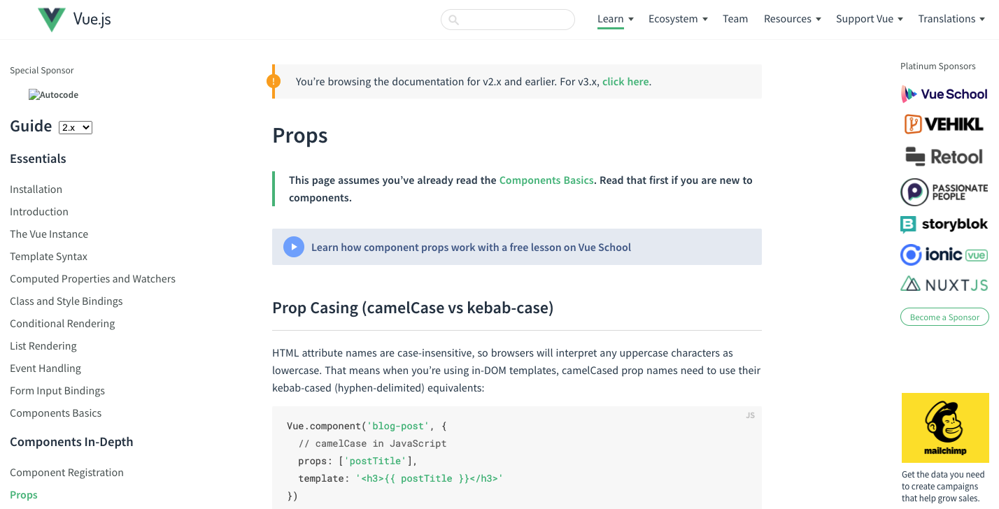

# Passing data down from parent to child component

## Understanding Props basics



In the last tutorial, we learned how to pass `data` from a `child component` to a `parent component` with the [`$emit()`](https://vuejs.org/v2/api/#vm-emit) method. However, most often than not we need to pass data from a `parent` to a `child component`. In this case, we should use [props](https://vuejs.org/v2/guide/components-props.htmla) instead.

`Props`(short for properties) is the mechanism to pass data down from a `parent component` to its `child components` in what it's called [One-Way Data Flow](https://vuejs.org/v2/guide/components-props.html#One-Way-Data-Flow). `Props` look like [`HTML5`](https://developer.mozilla.org/en-US/docs/Web/Guide/HTML/HTML5)'s `custom attributes` which allow `parent components` to pass data down to their `child components`, but not the other way around. This pattern prevents the mutation of state in a `parent component` from its `child components`, making your `app`'s data flow easier to reason & understand.

Also, once the `parent component` is updated its `child components` will be also refreshed. If you try to update a `prop` from a `child component`, Vue'll send you a warning in the developer console.

## How to pass props

Let's say we have a child component named `BlogPost.vue` which we're importing in a `parent component`. We can add `props` like so:

```vue
<template>
  <div class="post">
    <h1>{{ postTitle }}</h1>
  </div>
</template>

<script>
export default {
  name: "BlogPost",
  props: {
    postTitle: String,
  },
};
</script>
```

We declared a `postTitle` prop with a type of `String` in the `export object` & then we passed it in the template using `text interpolation`. Note that we're using `camelCase` naming to match `JavaScript's camelCase`'s naming convention. Now we can import the `BlogPost.vue` component into its `parent component` & pass data down using the `prop` like so:

```vue
template>
  <div id="app">
    <BlogPost
      post-title="Learn how to use props in Vue.js"
    />
  </div>
</template>

<script>
import BlogPost from "./components/BlogPost";

export default {
  name: "App",
  components: {
    BlogPost
  }
};
</script>
```

Note this time, we passed the `prop` plus its `value` like a `custom attribute` & we use `kebab-case` naming convention to match `HTML5's custom attributes` syntax.

This is good, but we can also passed a `default value` & decided if it's `required` or not like so:

```vue
<template>
  <div class="post">
    <h1>{{ postTitle }}</h1>
  </div>
</template>

<script>
export default {
  name: "BlogPost",
  props: {
    postTitle: {
      type: String,
      default: "This is the title",
      required: true,
    },
  },
};
</script>
```

Now, if we don't pass the `prop` custom attribute in the template, if its `type` is not a `string` or we don't pass any value to it. We'll get a warning error in the console. Stating that we need to pass the `postTitle` property, which needs to be a `string` type or `This is the title` will be displayed by default respectively. This also helps us document our component on how it's supposed to be used.

The type can be one of the following:

- String
- Number
- Boolean
- Array
- Object
- Date
- Function
- Symbol

That's all for the basics with `props`. You can learn much more by reading the [official documentation](https://vuejs.org/v2/guide/components-props.html).
